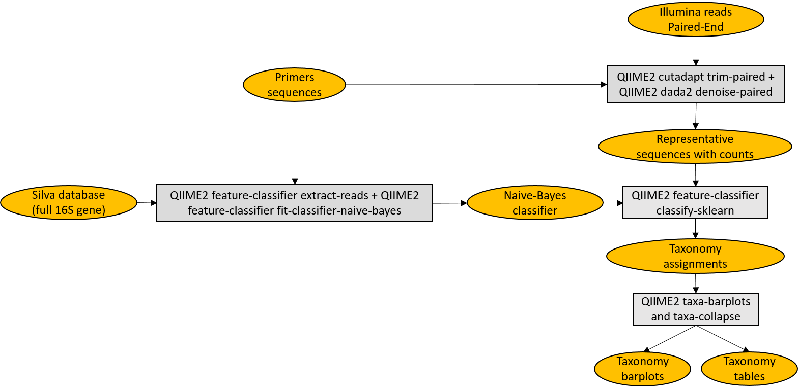

# QIIME2_Illumina

**QIIME2_Illumina** is a Meta-barcoding pipeline for analysing Illumina data in QIIME2 framework. Tested with Ubuntu 20.04.1 LTS.

<p align="center">
  
</p>

## Getting started

**Prerequisites**

* Miniconda3.
Tested with conda 4.8.5.
```which conda``` should return the path to the executable.
If you don't have Miniconda3 installed, you could download and install it with:
```
wget https://repo.anaconda.com/miniconda/Miniconda3-latest-Linux-x86_64.sh
chmod 755 Miniconda3-latest-Linux-x86_64.sh
./Miniconda3-latest-Linux-x86_64.sh
```

* A fasta file that you want to use as a reference database and a text file with taxonmy, or a preformatted [marker gene reference database](https://docs.qiime2.org/2020.11/data-resources/#taxonomy-classifiers-for-use-with-q2-feature-classifier).

**Installation**

```
git clone https://github.com/MaestSi/QIIME2_Illumina.git
cd QIIME2_Illumina
chmod 755 *
./install.sh
```

A conda environment named _QIIME2_Illumina_env_ is created, where qiime2-2020.11 is installed.

## Usage

The _QIIME2_Illumina_ pipeline is composed of a set of scripts which should be run sequentially. The pipeline assumes you keep the default name to output files, and leave them in the working directory.

**Train_classifier.sh**

Usage: Train_classifier.sh \<FW_primer\> \<RV_primer\> <DB_FASTA> <TAXONOMY_TSV>

Note: this script should be run only if you don't have a Naive-Bayes classifier trained on the region of interest of your marker gene yet.

Inputs:
* \<FW_primer\>: the sequence of the forward PCR primer
* \<RV_primer\>: the sequence of the reverse PCR primer
* \<DB_fasta\>: a fasta file containing sequences of the reference database
* \<TAXONOMY_tsv\>: a text file containing taxonomy corresponding to sequences in the reference database

Outputs:
* \<"DB".qza\>: _QIIME2_ artifact of type _DNAFASTAFormat_ containing reference sequences
* \<"TAXONOMY".qza\>: _QIIME2_ artifact of type _HeaderlessTSVTaxonomyFormat_ containing taxonomy of reference sequences

**Create_manifest.sh**

Usage: Create_manifest.sh \<sample_metadata\> \<reads_dir\>

Inputs:
* \<sample-metadata.tsv\>: file containing metadata for all samples, validated with [Keemei](https://keemei.qiime2.org/)
* \<reads_dir\>: directory containing R1 and R2 reads in fastq.gz format

Outputs:
* \<manifest.txt\>: file used for importing reads in QIIME2

**Import_data.sh**

Usage: Import_data.sh \<manifest.txt\> \<FW_primer\> \<RV_primer\>

Inputs:
* \<manifest.txt\>: file used for importing reads in QIIME2
* \<FW_primer\>: the sequence of the forward PCR primer
* \<RV_primer\>: the sequence of the reverse PCR primer

Outputs:
* \<sequences_untrimmed.qza\>: reads before PCR primers trimming
* \<sequences.qza\>: reads after PCR primers trimming
* \<demux_summary_untrimmed.qzv\>: QIIME2 visualization file for inspecting sequencing quality before PCR primers trimming
* \<demuz_summary.qzv\>: QIIME2 visualization file for inspecting sequencing quality after PCR primers trimming

**Denoise_sequences.sh**

Usage: Denoise_sequences.qza \<trim_left_FW\> \<trim_left_RV\> \<trunc_left_FW\> \<trunc_left_RV\>

Inputs:
* \<trim_left_FW\>: number of bases to be trimmed from 5' end of forward reads
* \<trim_left_RV\>: number of bases to be trimmed from 5' end of reverse reads
* \<trunc_left_FW\>: number of bases to truncate forward reads at (choose a value by looking at demuz_summary.qzv file)
* \<trunc_left_RV\>: number of bases to be truncate reverse reads at (choose a value by looking at demuz_summary.qzv file)

Outputs:
* \<rep-seqs.qz\*\>: representative sequences (Amplicon Sequence Variants, ASVs)
* \<table.qz\*\>: table with counts for each ASV
* \<denoising-stats.qzv\>: statistics describing denoising performed by DADA2

**Assign_taxonomy.sh**

Usage: Assign_taxonomy.sh \<classifier\>

Inputs:
* \<classifier\>: QIIME2 artifact (.qza) for Naive-Bayes classifier

Outputs:

* \<taxonomy.qz\*\>: taxonomy assigned to each ASV
* \<taxa-bar-plots.qzv\>: taxonomy barplot describing samples composition at each taxonomic level
* \<feature-table_\*freq.tsv\>: tables with the number or proportion of reads assigned to each taxa

**Diversity_analyses.sh**

Usage: Diversity_analyses.sh \<sampling_depth\>

Inputs:
* \<sampling_depth\>: minimum number of filtered fragments for a sample to be included in the analyses; the value should be chosen by looking at demuz_summary.qzv file

Outputs:

* \<core-metrics-results\>: directory containing various beta diversity analyses
* \<alpha-rarefaction.qzv\>: rarefaction curve, computing the dependance between sequencing depths and various alpha diversity metrics

## Results visualization

All .qzv and .qza artifacts can be visualized either importing them to [QIIME2 View](https://view.qiime2.org/) or with command:

```
source activate QIIME2_Illumina_env
qiime tools view <file.qz*>
```
## Citations


The QIIME2_Illumina pipeline is composed of some wrapper scripts for [QIIME2](https://qiime2.org/). Please, refer to the following manuscript for further information.

Bolyen E, Rideout JR, Dillon MR, Bokulich NA, Abnet CC, Al-Ghalith GA, Alexander H, Alm EJ, Arumugam M, Asnicar F, Bai Y, Bisanz JE, Bittinger K, Brejnrod A, Brislawn CJ, Brown CT, Callahan BJ, Caraballo-Rodríguez AM, Chase J, Cope EK, Da Silva R, Diener C, Dorrestein PC, Douglas GM, Durall DM, Duvallet C, Edwardson CF, Ernst M, Estaki M, Fouquier J, Gauglitz JM, Gibbons SM, Gibson DL, Gonzalez A, Gorlick K, Guo J, Hillmann B, Holmes S, Holste H, Huttenhower C, Huttley GA, Janssen S, Jarmusch AK, Jiang L, Kaehler BD, Kang KB, Keefe CR, Keim P, Kelley ST, Knights D, Koester I, Kosciolek T, Kreps J, Langille MGI, Lee J, Ley R, Liu YX, Loftfield E, Lozupone C, Maher M, Marotz C, Martin BD, McDonald D, McIver LJ, Melnik AV, Metcalf JL, Morgan SC, Morton JT, Naimey AT, Navas-Molina JA, Nothias LF, Orchanian SB, Pearson T, Peoples SL, Petras D, Preuss ML, Pruesse E, Rasmussen LB, Rivers A, Robeson MS, Rosenthal P, Segata N, Shaffer M, Shiffer A, Sinha R, Song SJ, Spear JR, Swafford AD, Thompson LR, Torres PJ, Trinh P, Tripathi A, Turnbaugh PJ, Ul-Hasan S, van der Hooft JJJ, Vargas F, Vázquez-Baeza Y, Vogtmann E, von Hippel M, Walters W, Wan Y, Wang M, Warren J, Weber KC, Williamson CHD, Willis AD, Xu ZZ, Zaneveld JR, Zhang Y, Zhu Q, Knight R, and Caporaso JG. 2019. Reproducible, interactive, scalable and extensible microbiome data science using QIIME 2. Nature Biotechnology 37: 852–857. https://doi.org/10.1038/s41587-019-0209-9
